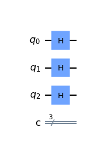

# Quantum Poker

This game is inspired by poker, with a quantum flavour! This game requires 3 players. Each player is assigned a qubit in the quantum circuit, and the objective of the game is to make sure that your qubit is in the **|1>** state upon measurement!

## Card Deck
In this game, the cards are quantum gates themselves! There are a total of 12 cards and they are:
* 1 SWAP gate,
* 1 Toffoli gate,
* 1 Hadamard gate,
* 3 Pauli X-gates,
* 3 CNOT gates,
* 3 Measure gates.

The cards can be used on the quantum circuit, applying a gate on it with the respective control and target qubits specified by the players.
  
## Gameplay

1. In the beginning, the quantum citcuit is initialised as shown above.
2. Before the round begins, each player is given a Measure gate. Then the rest of the cards are shuffled and split among all players equally. 
3. The players can only see their own cards. 
4. At each player's turn, the player must use one card, specifying the card's control and target, when applicable.
5. The corresponding gate on the card will be applied onto the circuit above.
6. The circuit is visible to all players at all times.
7. When all players has taken their turn to put down their cards, the round ends.
8. All cards can be used at any round, except for the Measure card. The Measure card can only be used after the end of the first round.
9. The game ends when all players run out of cards, or when a Measure card is put down.

## How to Win
Before the game begins, the players contribute an equal amount to the total prize pool, while the house contribute the sum of the players' contribution. The total prize pool is thus contribute 50% from the players, and 50% from the house. 
There are 3 different types of outcomes upon measuring the quantum circuit.
* **|000>** or **|111>**: All players lose. The house takes 100% of the prize pool. The players lose their share.
* **|100>**, **|010>**, or **|001>**: One player wins. The winner takes 100% of the prize pool. The house loses its share.
* **|110>**, **|101>**, or **|011>**: Two players win. The two winners split 50% of the prize pool. The house gets to keep its share.

## Future Work
* GUI for gameplay.
* Probability Calculator for players using quantum simulator.
* Include more players!